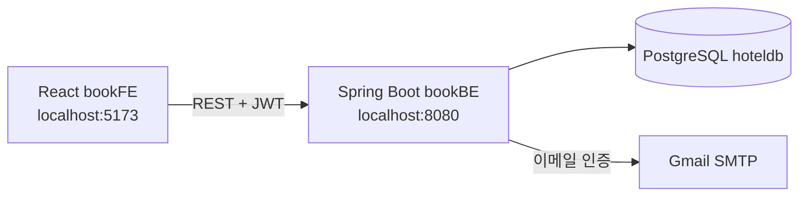

# HotelBooker


복잡한 DB 설계·관리 연습을 목적으로 만든 호텔 객실 예약 시스템입니다. 사용자 예약부터 관리자 대시보드, 결제, 리뷰까지 호텔 운영에 필요한 기능을 포함합니다.

| 항목 | 내용 |
|------|------|
| **상태** | 개발 완료 (로컬) |
| **유형** | 개인 프로젝트 (1인 풀스택) |
| **목적** | 예약·결제·리뷰·관리자 권한이 얽힌 DB 스키마 설계 연습 |

---

## 목차

- [소개](#소개)
- [주요 기능](#주요-기능)
- [기술 스택](#기술-스택)
- [시스템 구조](#시스템-구조)
- [데이터베이스 설계](#데이터베이스-설계)
- [외부 API 키 및 필수 기능](#외부-api-키-및-필수-기능)
- [프로젝트 구조](#프로젝트-구조)
- [시작하기](#시작하기)
- [API 문서](#api-문서)
- [보안 · API 키 관리](#보안--api-키-관리)
- [참고](#참고)

---

## 소개

HotelBooker는 JWT 기반 인증, 객실 예약·결제, 리뷰, 관리자 대시보드를 갖춘 풀스택 호텔 예약 웹 서비스입니다. 사용자/관리자 역할 분리와 복잡한 엔티티 관계를 직접 설계·구현하는 데 초점을 맞췄습니다.

---

## 주요 기능

| 구분 | 기능 |
|------|------|
| **사용자** | 회원가입·로그인 (JWT), 아이디/비밀번호 찾기 (이메일 인증) |
| | 객실 조회 (목록, 상세, 이미지), 예약·조회·취소 |
| | 결제 (카드, 계좌이체, 현금), 리뷰·평점 작성 |
| | 마이페이지 (예약 내역, 리뷰 관리), 공지사항 |
| **관리자** | 대시보드 (예약·체크인·체크아웃, 객실 상태, 월별 매출) |
| | 객실 CRUD, 예약 상태 변경, 리뷰 공개/비공개·관리자 답변 |
| | 공지사항 관리, 기간별 통계·매출 분석 |

---

## 기술 스택

| 영역 | 기술 |
|------|------|
| **Backend** (`bookBE`) | Spring Boot 3.3.4, Java 17, Spring Data JPA, Spring Security + JWT |
| **Frontend** (`bookFE`) | React 19, Vite 7, Tailwind CSS, React Router, Axios |
| **Database** | PostgreSQL |
| **API 문서** | SpringDoc OpenAPI (Swagger) |
| **이메일** | Spring Mail (Gmail SMTP) |

---

## 시스템 구조



---

## 데이터베이스 설계

상세 스키마: [03_데이터베이스.md](03_데이터베이스.md)

```mermaid
erDiagram
    users ||--o{ bookings : makes
    users ||--o{ reviews : writes
    rooms ||--o{ bookings : has
    rooms ||--o{ reviews : receives
    bookings ||--|| payments : has
    bookings ||--o| reviews : optional

    users {
        string id PK
        string email UK
        string role
    }
    rooms {
        bigint id PK
        string name
        decimal price_per_night
        string status
        boolean available
    }
    bookings {
        bigint id PK
        string user_id FK
        bigint room_id FK
        date check_in_date
        date check_out_date
        string status
    }
    payments {
        bigint id PK
        bigint booking_id FK UK
        decimal amount
        string method
        string status
    }
    reviews {
        bigint id PK
        string user_id FK
        bigint room_id FK
        int rating
        boolean is_public
    }
    notices {
        bigint id PK
        string title
        string type
    }
    email_verifications {
        bigint id PK
        string email
        string code
        timestamp expires_at
    }
```

| 테이블 | 설명 |
|--------|------|
| `users` | 사용자·관리자 (`USER` / `ADMIN`) |
| `rooms` | 객실 정보, `status` (CLEAN/DIRTY/MAINTENANCE) |
| `bookings` | 예약 (CONFIRMED → CHECKED_IN → CHECKED_OUT) |
| `payments` | 결제 (CARD/BANK_TRANSFER/CASH), 법적 증빙 보존 |
| `reviews` | 리뷰·평점, 관리자 답변 |
| `notices` | 공지·이벤트·프로모션 |
| `email_verifications` | 회원가입·계정 복구 인증 코드 |

---

## 외부 API 키 및 필수 기능

| 환경 변수 / 설정 | 필수 | 연동 기능 | 없을 때 |
|------------------|------|-----------|---------|
| `spring.datasource.*` | ✅ | PostgreSQL 연결 | 서버 시작 불가 |
| `HBJWT_SECRET` | ✅ (프로덕션) | JWT 발급·검증 | 기본값 사용 (개발용) |
| `HBJWT_EXPIRATION` | | 토큰 만료 (기본 30일) | 기본값 사용 |
| `MAIL_USERNAME` | 이메일 기능 시 | Gmail SMTP 발신 | 이메일 인증·비밀번호 찾기 불가 |
| `MAIL_PASSWORD` | 이메일 기능 시 | Gmail 앱 비밀번호 | 메일 발송 실패 |

> 외부 결제 PG 연동 없음 — 결제는 시뮬레이션 방식으로 구현

---

## 프로젝트 구조

```
HotelBooker/
├── bookBE/                 # 백엔드 (Spring Boot)
│   └── src/main/java/com/hotel/booking/
│       ├── auth/           # 인증, 회원가입, 계정 복구
│       ├── booking/        # 예약 관리
│       ├── payment/        # 결제
│       ├── review/         # 리뷰
│       ├── room/           # 객실
│       ├── admin/          # 관리자 기능
│       └── notice/         # 공지사항
├── bookFE/                 # 프론트엔드 (React)
│   └── src/pages/          # Home, Login, Rooms, Booking, AdminDashboard 등
└── HOTEL_BOOKING_SYSTEM_DOCUMENTATION.md
```

---

## 시작하기

### 사전 요구사항

- Java 17+
- Node.js 18+
- PostgreSQL 12+

### 1. 데이터베이스

```sql
CREATE DATABASE hoteldb;
```

### 2. 백엔드

```bash
cd bookBE
# application.yml에서 DB·JWT·Mail 설정 수정
./gradlew bootRun
```

- 서버: `http://localhost:8080`
- Swagger: `http://localhost:8080/swagger-ui.html`

### 3. 프론트엔드

```bash
cd bookFE
npm install
npm run dev
```

- 앱: `http://localhost:5173`

---

## API 문서

Swagger UI에서 전체 API를 확인할 수 있습니다.

`http://localhost:8080/swagger-ui.html`

---

## 보안 · API 키 관리

| 항목 | 상태 | 비고 |
|------|------|------|
| OpenAI 등 외부 AI 키 | 해당 없음 | — |
| DB 비밀번호 | ⚠️ 로컬 기본값 포함 | `application.yml` — 배포 시 환경 변수로 교체 권장 |
| JWT Secret | ⚠️ 기본 fallback 존재 | `HBJWT_SECRET` 환경 변수로 반드시 설정 |
| Gmail 비밀번호 | ✅ env 변수 | `MAIL_USERNAME`, `MAIL_PASSWORD` |
| `.env` / gitignore | — | Spring `application.yml` 직접 관리 |

**권장 사항**
- 프로덕션 배포 시 `application.yml`의 DB·JWT 값을 환경 변수로 분리
- Gmail 앱 비밀번호는 저장소에 커밋하지 않음

---

## 참고

- 예약·결제·리뷰·관리자 권한이 얽힌 **복잡한 DB 스키마** 설계 경험
- Swagger로 API 문서화하여 프론트·백엔드 연동 효율화
- 상세 문서: [HOTEL_BOOKING_SYSTEM_DOCUMENTATION.md](HOTEL_BOOKING_SYSTEM_DOCUMENTATION.md), [03_데이터베이스.md](03_데이터베이스.md)
