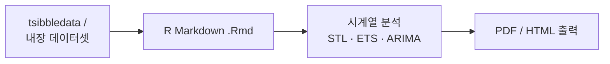
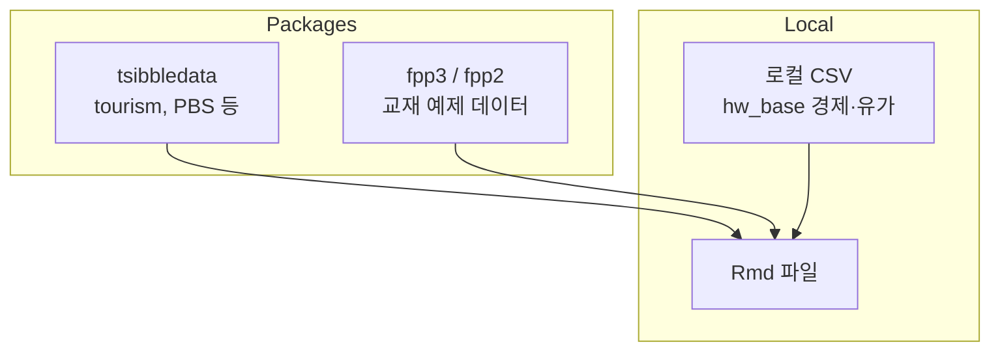

# Rdata


R 언어 기반 시계열 예측(Forecasting) 과목의 과제·실습 자료 저장소입니다. *Forecasting: Principles and Practice (3rd ed)* 교재 연습문제를 R Markdown으로 풀고 정리했습니다.

| 항목 | 내용 |
|------|------|
| **상태** | 학습 자료 |
| **유형** | 개인 과제·실습 |
| **언어** | R, R Markdown |

---

## 목차

- [소개](#소개)
- [주요 내용](#주요-내용)
- [기술 스택](#기술-스택)
- [분석 워크플로우](#분석-워크플로우)
- [데이터 소스](#데이터-소스)
- [외부 API 키 및 필수 기능](#외부-api-키-및-필수-기능)
- [프로젝트 구조](#프로젝트-구조)
- [시작하기](#시작하기)
- [보안 · API 키 관리](#보안--api-키-관리)
- [참고](#참고)

---

## 소개

시계열 분석과 예측 기법을 R로 실습한 과제 모음입니다. STL 분해, ARIMA, 지수평활법 등 교재 챕터별 연습문제를 Rmd 파일로 작성하고 PDF/HTML로 출력했습니다.

---

## 주요 내용

| 폴더 | 내용 |
|------|------|
| `2176071_hw01` ~ `hw09` | 챕터별 과제 (Rmd + PDF) |
| `hw_base` | 경제·유가 관련 리포트 실습 |
| `교재` | 교재 챕터별 HTML 요약 자료 |

### 과제 주제 (예시)

| 과제 | 주제 |
|------|------|
| hw01 | 기초 연습 (tourism 데이터 등) |
| hw02 | Chapter 3 exercises |
| hw03 | PBS STL 분석 |
| hw04 | Chapter 5 exercises |
| hw05 ~ hw09 | Chapter 8~9 exercises (지수평활, ARIMA 등) |

---

## 기술 스택

| 영역 | 기술 |
|------|------|
| **Language** | R 4.x |
| **문서** | R Markdown (.Rmd), knitr |
| **출력** | PDF, HTML |
| **패키지** | `forecast`, `fpp3`, `fpp2`, `tsibble`, `tsibbledata`, `feasts`, `ggplot2` |
| **교재** | Forecasting: Principles and Practice (3rd ed) |

---

## 분석 워크플로우



---

## 데이터 소스

DB 없이 **R 패키지 내장 데이터**와 **로컬 CSV**를 사용합니다.



| 데이터 | 출처 | 사용 과제 |
|--------|------|-----------|
| `tourism` | `tsibbledata` | hw01 등 |
| `PBS` | `tsibbledata` | hw03 STL |
| 경제·유가 시계열 | 로컬 파일 | `hw_base/` |

---

## 외부 API 키 및 필수 기능

| 항목 | 필수 | 용도 | 없을 때 |
|------|------|------|---------|
| 외부 API 키 | 해당 없음 | — | — |
| R + RStudio | ✅ | Rmd 편집·Knit | 실행 불가 |
| LaTeX (PDF 출력 시) | PDF Knit 시 | PDF 렌더링 | HTML만 생성 가능 |
| `forecast`, `fpp3` 등 | ✅ | 시계열 분석 | 패키지 설치 필요 |

```r
install.packages(c("rmarkdown", "knitr", "forecast", "fpp3", "fpp2",
                   "tsibble", "tsibbledata", "feasts", "ggplot2", "dplyr"))
```

---

## 프로젝트 구조

```
Rdata/
├── 2176071_hw01/       # 과제 1
├── 2176071_hw02/       # 과제 2
├── ...
├── 2176071_hw09/       # 과제 9
├── hw_base/            # 경제·유가 리포트 실습
│   ├── 2176071_economy.Rmd
│   └── 2176071_oil.Rmd
└── 교재/               # 교재 챕터 HTML 요약
```

---

## 시작하기

### 사전 요구사항

- R 4.x+
- RStudio (권장)
- R Markdown, knitr, 관련 패키지

### Rmd 실행

```r
# RStudio에서 .Rmd 파일 열기 → Knit 버튼으로 PDF/HTML 생성
```

또는 터미널:

```bash
Rscript -e "rmarkdown::render('2176071_hw01/exercise_2_10_q1.Rmd')"
```

---

## 보안 · API 키 관리

| 항목 | 상태 |
|------|------|
| 외부 API 키 | 해당 없음 |
| `.env` / 시크릿 | 사용하지 않음 |
| Chrome Web Store | 해당 없음 |
| 개인정보 데이터 | 교육용 공개 데이터셋만 사용 |

---

## 참고

- 각 과제 폴더에 `.Rmd` (소스)와 `.pdf` (제출본)가 함께 있습니다.
- `교재/` 폴더는 FPP3 교재 챕터별 HTML 요약 자료입니다.
