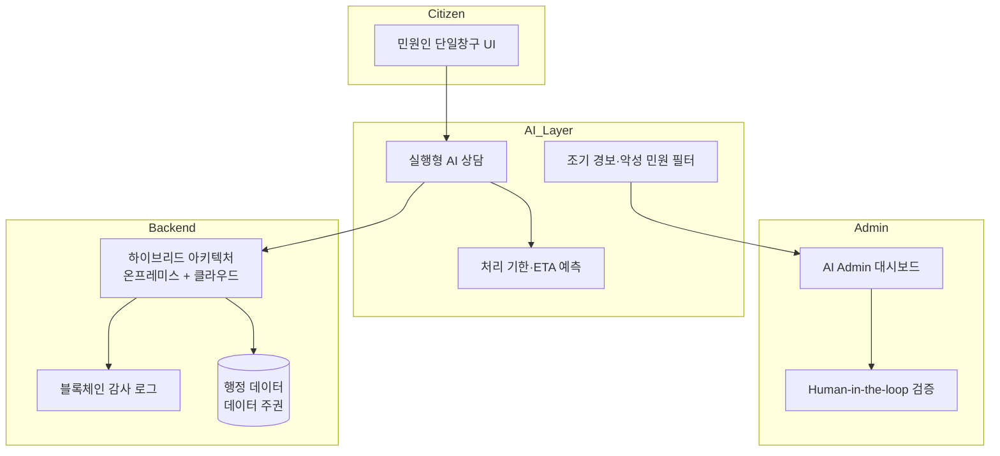
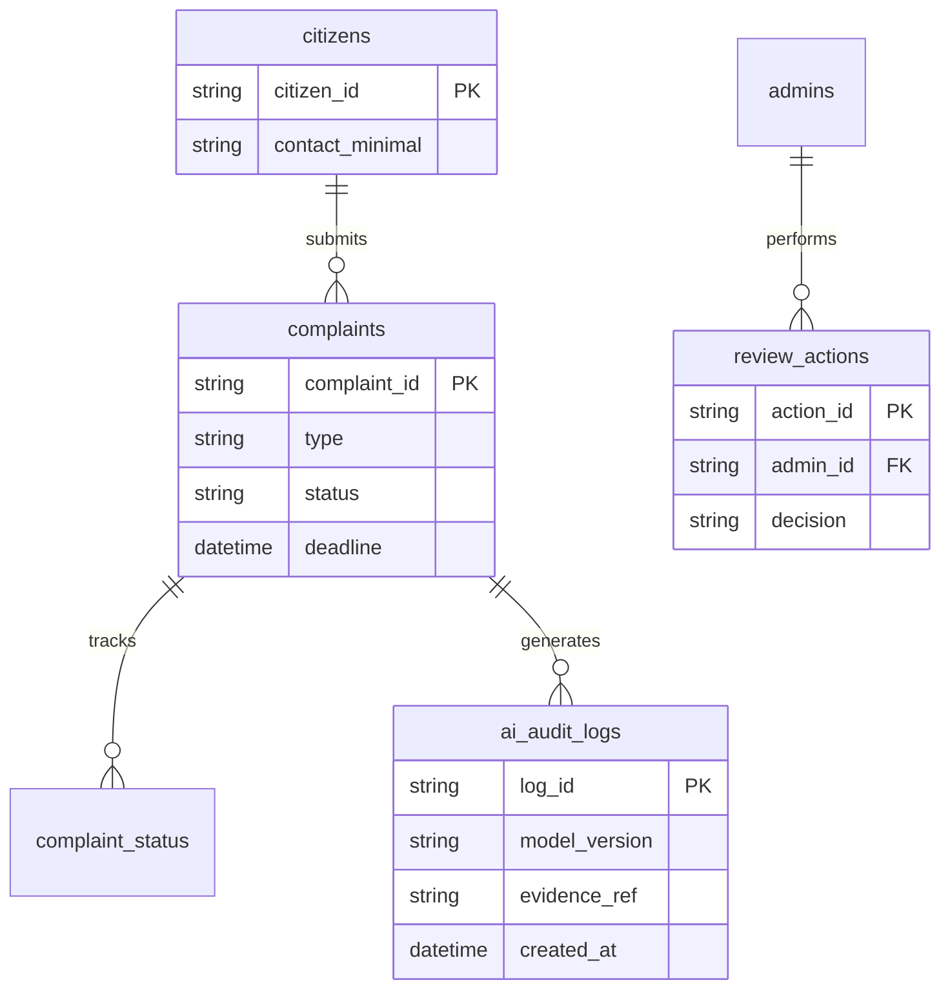

# minwonAI


생성형 AI를 활용한 민원·행정 업무 고도화를 제안하는 종합 제안서 및 관련 자료 저장소입니다.

| 항목 | 내용 |
|------|------|
| **상태** | 제안서 완료 |
| **유형** | 개인 프로젝트 (기획·설계) |
| **형태** | 코드 없음 — 문서·제안서 중심 |

---

## 목차

- [소개](#소개)
- [주요 내용](#주요-내용)
- [제안 아키텍처](#제안-아키텍처)
- [데이터·시스템 설계 (제안)](#데이터시스템-설계-제안)
- [외부 API 키 및 필수 기능](#외부-api-키-및-필수-기능)
- [프로젝트 구조](#프로젝트-구조)
- [시작하기](#시작하기)
- [보안 · API 키 관리](#보안--api-키-관리)
- [특징](#특징)
- [참고](#참고)

---

## 소개

minwonAI는 공공 행정의 칸막이 구조, 분절된 민원 서비스, 안내형 AI의 한계를 분석하고, **실행형 AI 단일창구**와 **선제적 거버넌스**를 제안하는 프로젝트입니다. 최신 정부 정책·AI 기술 트렌드를 반영한 구체적 실행 계획을 담고 있습니다.

---

## 주요 내용

| 주제 | 설명 |
|------|------|
| **문제 정의** | 칸막이 행정, 복합 민원 지연, 디지털→지능형 전환 필요성 |
| **AI 민원 상담** | 실시간 대화형 단일창구, 신청·접수·발급까지 연결되는 One-Flow |
| **조기 경보 시스템** | 악성·특이 민원 필터링, 행정 안전망 |
| **AI Admin** | 지능형 업무 보조, Human-in-the-loop 검증 |
| **보안·신뢰** | 하이브리드 아키텍처, 블록체인 감사 추적, 데이터 주권 |

---

## 제안 아키텍처



---

## 데이터·시스템 설계 (제안)

실행 코드는 없으며, 제안서에 기술된 **개념적 데이터 흐름**입니다.



| 개념 | 설명 |
|------|------|
| `complaints` | 민원 접수·처리 상태 (One-Flow) |
| `ai_audit_logs` | AI 응답 근거·모델 버전 감사 추적 |
| `review_actions` | Human-in-the-loop 관리자 검증 기록 |

---

## 외부 API 키 및 필수 기능

본 저장소는 **실행 코드가 없으므로** API 키가 필요하지 않습니다. 제안서에서 언급하는 향후 구현 시 고려 사항:

| 구성 요소 | 제안 시 필수 여부 | 용도 |
|-----------|-------------------|------|
| 생성형 AI API (온프레미스/전용) | ✅ | 민원 상담·문서 생성 |
| 정부24·부처 연계 API | ✅ | 신청·접수·발급 One-Flow |
| 블록체인 감사 노드 | 제안 | AI Audit 로그 불변 저장 |
| Chrome Web Store | 해당 없음 | 웹·행정 포털 연동 제안 |

---

## 프로젝트 구조

```
minwonAI/
├── final_comprehensive_proposal.md   # 종합 제안서 (핵심 문서)
├── 자료/                             # 참조 분석 보고서·통계 (PDF)
└── README.md
```

---

## 시작하기

```bash
git clone https://github.com/SxxM131/minwonAI.git
cd minwonAI
```

**[final_comprehensive_proposal.md](./final_comprehensive_proposal.md)** — 국가 AI 행정 단일창구 및 선제적 거버넌스 통합 제안서

### 제안서 구성 (요약)

1. **문제 정의** — 칸막이 행정, 복합 민원 비용, 악성 민원 증가
2. **솔루션** — 실행형 AI 단일창구, 상태 추적, 신뢰 설계
3. **아키텍처** — 하이브리드, AI Admin, 조기 경보
4. **실행 계획** — 단계별 도입 로드맵

---

## 보안 · API 키 관리

| 항목 | 상태 |
|------|------|
| 실행 코드 | 없음 |
| API 키·시크릿 | 저장소에 포함되지 않음 |
| `자료/` PDF | 공개 참조 자료 (민감 정보 없음) |

---

## 특징

- 최신 정부 정책 및 AI 기술 트렌드 반영
- 정량적 근거 (정부24 이용 통계, 처리기한 초과율 등) 기반 문제 정의
- 보안·책임성·감사 가능성을 전제로 한 설계

---

## 참고

- 본 저장소는 실행 코드가 아닌 **제안서·설계 문서**를 담고 있습니다.
- `자료/` 폴더의 PDF는 제안서 작성 시 참조한 분석 보고서입니다.
